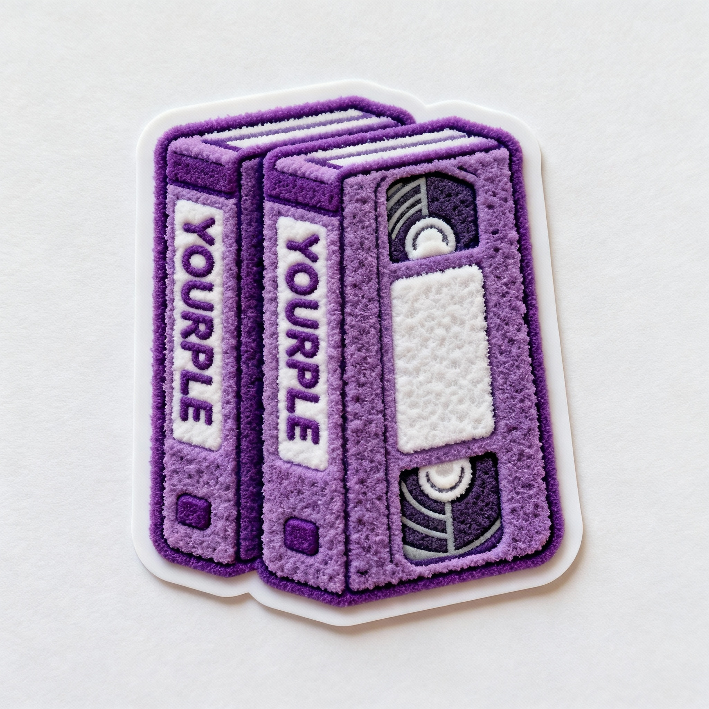

# YOURPLE - YouTube Downloader Chrome Extension

  

<h3 align="center">YOURPLE brings you the easiest way to download YouTube videos in 4K, convert to MP3, and grab Shorts — all with a sleek deep purple vibe. No ads. No clutter. Just fast, secure downloads.</h3>

---

## Key Features

- **Stunning Deep Purple UI:** Modern, distraction-free design for fans of clean, elegant interfaces.
- **4K Video Downloads:** Save any YouTube video in Ultra HD quality—including 8K where available!
- **High-Quality MP3 Conversion:** Extract audio at 320kbps with just a click.
- **YouTube Shorts Support:** Download Shorts instantly—no extra hoops.
- **No Ads, No Extra Software:** 100% open source, privacy-respecting. No bundled bloat.
- **Cross-Platform:** Works on Chrome, Edge, Brave, Vivaldi, Opera, and Firefox (see install below).
- **Private & Member Video Support:** Download videos you have access to—even private or premium.
- **Easy Controls:** One-click download, quality selector, clear progress bar.

---

## Screenshots

  

  

---

## Installation

### Chrome, Brave, Vivaldi, Opera
1. Download the latest YOURPLE release from [GitHub Releases](https://github.com/rjinnmlinux/Youtube-Downloader-Extension/releases).
2. Open `chrome://extensions`.
3. Enable **Developer mode** at the top right.
4. Click **Load unpacked**, select your extracted YOURPLE folder.

### Microsoft Edge
1. Same as Chrome, or visit Edge Add-ons store if available.

### Firefox
1. Download the `.xpi` add-on release.
2. Open Firefox Add-ons settings and choose **Install Add-on from File**.

---

## FAQ

**How do I download videos in 4K?**  
Navigate to any YouTube video, click the YOURPLE icon, choose your desired quality—download instantly.

**Can I save Shorts videos?**  
Absolutely! YOURPLE detects Shorts and offers a separate Shorts download button in the pop-up.

**How is audio extraction done?**  
Click the "Audio Only" tab in YOURPLE's popup and choose your MP3 quality (up to 320kbps).

**Is YOURPLE safe and private?**  
Yes! YOURPLE is 100% open source and does not collect or transmit any personal data. Your downloads are local and secure.

---

## Contributing

Want to help?  
- Fork the repo  
- Open pull requests for features, theme tweaks, bug fixes, or translations  
- [File issues](https://github.com/rjinnmlinux/Youtube-Downloader-Extension/issues) for bugs or suggestions

---

## License

YOURPLE is released under the MIT License.

---

## Credits

Originally forked and modernized from Tubly Downloader.  
Inspired by fans of clean, beautiful UI and open source tools.

---

## About

YOURPLE: The modern deep purple YouTube downloader for Chrome—4K, MP3, and Shorts with elegance.

---

